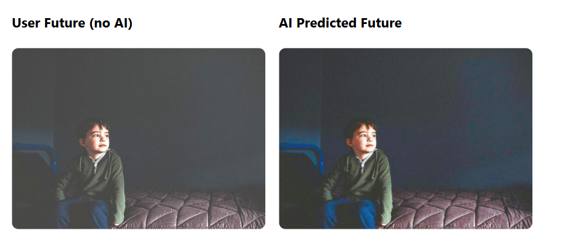

# Team 39 Image Editor

An advanced image editing application with 2 AI powered features, non linear history management, and real time segmentation.

## Features

### Core Editing
- **Adjustments**: Brightness, contrast, saturation, blur, sharpen, hue, opacity
- **Transformations**: Rotation, horizontal/vertical flip
- **LUT Filters**: 35 professional color grading presets
- **AI Segmentation**: Automatic object detection, segmentation with feature to combine various segments
- **Background Replacement**: Custom backgrounds with AI generated scenes and relighting 

### Advanced History System
- **Non Linear Tree Based History**: Explore multiple edit paths from any point
- **Branching**: Create and compare alternative editing approaches
- **Time Travel**: Jump to any historical state instantly
- **Visual Preview**: Thumbnail view of all edits with applied filters
- **AI Optimization**: Neural network powered edit suggestions (NeurOP)
- **Smart Branching**: Automatic deduplication and state coalescing

### Canvas Editing System
- **Real time Filters**: Hardware accelerated CSS filters for instant preview
- **LUT Color Grading**: 35+ professional cinema style color presets
- **Smart Caching**: Optimized rendering pipeline with result caching
- **Segment Overlays**: Non destructive segment editing with automatic re segmentation
- **AI Enhancement**: Qwen powered lighting matching and background scene generation
- **WaterMark**: WaterMarks are added to the images downloaded from the app

### Voice Input System
- **Web Speech API**: Browser native voice to text conversion (~100ms latency)
- **Natural Commands**: "Increase brightness", "Apply warm filter", "Flip horizontal"
- **Real time Feedback**: Audio level visualization during recording
- **Zero Setup**: No ML model downloads required (instant availability)
- **Smart Fallback**: Text input always available for all browsers

## AI Feature 1 : Segmentation & Inpainting Pipeline

### How It Works

The pipeline combines local segmentation with cloud based image editing to handle complex image manipulation tasks.

### Image Upload & Segmentation

When you upload an image, it goes straight to *MobileSAM* for segmentation. The model uses a Vision Transformer (ViT) backbone to extract image features. You can refine the mask by tapping and holding on your screen to add points. All of this runs on the local backend server—no heavy GPU needed here.

### Cloud Based Image Editing

The actual image generation happens on HuggingFace Spaces (Note: HuggingFace spaces are paid), where we're running *Qwen Image Edit 2509* with three specialized LoRAs:

- *White to Scene*: Generates realistic backgrounds for product images
- *Fusion*: Blends cutouts or rough pastes seamlessly into scenes
- *Relight*: Changes lighting, theme, and overall mood

### Processing Flow

Every edit exports the entire canvas as an image (PNG/JPG) and sends it to the model. Simple as that—no incremental updates, just full canvas snapshots per request.

### Architecture Summary

User Image → MobileSAM (local) → Mask Selection → Canvas Export → Qwen Model (HF Space) → Result

# Qwen Image Editing Models

Below are the three Qwen-based image editing models along with their Hugging Face links and example output GIFs embedded for visibility.

---

## **1. Qwen White to Scene**

**Model Link:** [https://huggingface.co/dx8152/Qwen-Image-Edit-2509-White_to_Scene](https://huggingface.co/dx8152/Qwen-Image-Edit-2509-White_to_Scene)

**Output Example:**


---

## **2. Qwen Fusion**

**Model Link:** [https://huggingface.co/dx8152/Qwen-Image-Edit-2509-Fusion](https://huggingface.co/dx8152/Qwen-Image-Edit-2509-Fusion)

**Output Example:**


---

## **3. Qwen Relight**

**Model Link:** [https://huggingface.co/dx8152/Qwen-Image-Edit-2509-Relight](https://huggingface.co/dx8152/Qwen-Image-Edit-2509-Relight)

**Output Example:**


---

If you want, I can expand this into a full README with usage instructions, installation steps, examples, badges, or comparison tables.


The split between local segmentation and remote generation keeps things fast while still leveraging powerful GPU infrastructure where it matters.

## AI Feature 2 : Predictive Color Assist Pipeline

### 1. Predictive Color Assist

Predictive Color Assist feature **learns a user’s editing history** and suggests **intent aware color adjustments** based on **past edits**. The system generates an **optimized future image** to help refine edits, allowing users to **fine tune their images** while maintaining **creative control**.

---

### 2. Need of this Feature

- While **AI auto enhance tools** exist, they are often **too generic** and lack the ability to provide personalized results. On the other hand, **manual controls** for **color** and **tone adjustments** are time consuming and challenging for users to balance with speed.

---

### 3. Architecture Summary 

START → [User edits photo] → [Select past edit (i)] → [Rebuild image + low-res copy]
  →
[Compute deltas + generate candidates] → [Run NeurOP + apply LUT] → [Calculate Score]
  →
[Select best candidate] → [Apply to full-res image] → [Show AI-optimized result]
  →
User decision: Accept → Save to history | Reject → Keep original
END

---




## Detailed Documentation: 

> - [History_system.md](./History_system.md) - Complete history architecture
> - [Canvas_editing_system.md](./Canvas_editing_system.md) - Canvas filters, LUT application, and segment merging
> - [voice_input.md](./voice_input.md) - Voice to text conversion
> - [predictive.md](./predictive.md) - Predictive Color Assist


## Usage

1. **Upload Image**: Click to upload or drag and drop
2. **Edit**: Use sliders and tools to adjust image properties
3. **Segment**: Click "Segment" to detect objects (automatic on image load)
4. **History**: Click history button to explore edit branches
5. **Save**: Save final result to your gallery
6. **Download**: Download the final edited image

## Technology Stack

**Frontend:**
- React + Vite
- TailwindCSS
- GSAP
- Three.js
- Canvas API for image processing
- ONNX Runtime for on device ML inference

**Backend:**
- FastAPI (Python)
- Qwen AI Models (inpainting, lighting)
- MobileSAM (segmentation)
- MongoDB (user data and images)
- PIL for image manipulation

## Repository Structure

```
├── Demo Video/
│   └── Demo Video.mp4
│
├── Design Rationale/
│   └── Design_Rationale__Team_39.pdf
│
├── Figma Mock-ups/
│   ├── Adobe Re-Imagining Photoshop.pdf
│   ├── Adobe Re-Imagining Photoshop@2x.pdf
│   └──  Adobe Re-Imagining Photoshop@3x.pdf
│ 
├──  Market Research/
│   └── Market_Research.pdf  
│
├── backend/               # FastAPI backend application
│
├── public/               
│   ├── luts/
│   ├── model/
│   └── images/
│
└── src/                   # Frontend source code (React etc.)
```

## History System Overview

The editor uses a **tree based history structure** (not linear undo/redo). Key benefits:

- **No Lost Work**: All edit branches preserved indefinitely
- **Compare Options**: View multiple editing approaches side by side
- **AI Assistance**: Get ML powered optimization suggestions at branch points
- **Visual Navigation**: Thumbnail grid shows complete edit history
- **Performance**: Smart debouncing prevents history pollution from slider movements

**Example Tree Structure:**
```
Initial State
  ├─→ Brightness +20
  │     ├─→ Contrast +10 → Saturation -20
  │     └─→ [Branch A] Blur +5 → Rotation 90°
  └─→ [Branch B] LUT: Arabica → Hue +45°
```

Each node stores complete state, enabling instant jumps to any historical configuration.

## Installation

### Backend
```bash
python -m venv env
env\Script\activate.bat
pip install -r requirements.txt
uvicorn backend.main:app
```

### Frontend
```bash
npm install
npm run dev
```

### Setting up env
The env has USERMAIL, PASSWORD, URI (for mongodb database), DB_NAME (any name), SECRET_KEY (for the fastapi backend), HF_TOKEN (for the qwen model)

## License

MIT
