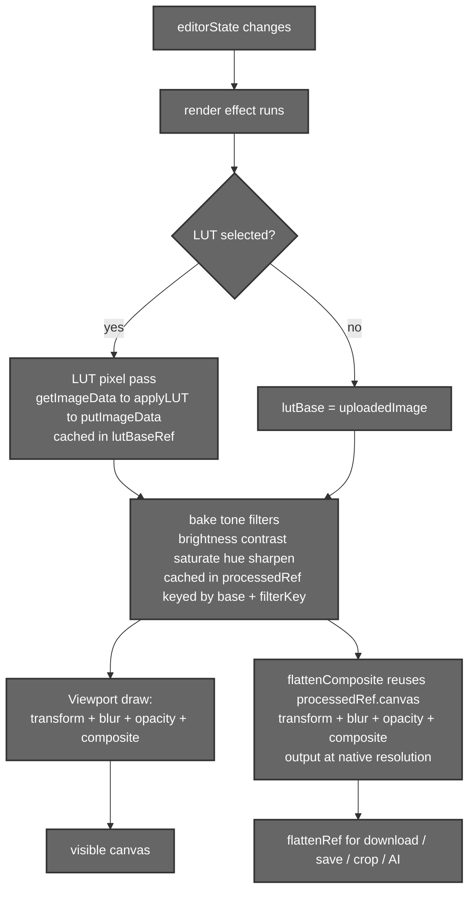
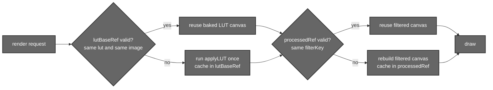

# Canvas Rendering System

## 1. Introduction

The Canvas is the heart of Aurora. Every visible pixel — the photo, its
adjustments, colour grading, dropped segments and overlays — is composited on a
single HTML5 `<canvas>` in real time. Editing is **fully non‑destructive**: the
original `HTMLImageElement` is never mutated. Instead, the current
`editorState` (a plain object held in the history tree) describes *how* to draw
the image, and the canvas re‑renders whenever that state changes.

The system has two render paths that share the exact same maths:

- **Viewport render** — what you see on screen (fit‑to‑screen, zoom/pan aware).
- **`flattenComposite` render** — a full **native‑resolution** copy used for
  exports (download / save), crops and AI hand‑offs. This is the WYSIWYG (What You See Is What You Get)
  guarantee: what is exported is pixel‑for‑pixel what the viewport shows, just at
  full resolution and with no letterbox (resizing an image while preserving its aspect ratio by adding padding (usually black) to fit the target dimensions.).

---

## 2. Files that hold the logic

| File | Responsibility |
|------|----------------|
| `src/components/MainEditor/UI/Canvas.jsx` | The main canvas component. Builds the CSS‑filter string, runs the LUT offscreen pass, caches processed results, composites segments/overlays, and exposes `flattenComposite` to the editor via `registerFlatten`. |
| `src/components/MainEditor/Utils/CanvasUtils.js` | Pointer maths: `getCanvasCoords`, pan/zoom handlers, object drag/drop, and the 600 ms long‑press detector (`startLongPress`) used to pick a segment. |
| `src/components/MainEditor/UI/Editor.jsx` | Owns `flattenRef` (the registered flatten function) and uses it for `getExportCanvas`, `downloadImage`, `saveImage` and crop. |
| `src/components/MainEditor/Utils/LUTUtils.js` | The pixel‑level LUT engine (`parseCubeLUT`, `applyLUT`). See **[02 – Edits & LUT Engine](./02-edits-and-luts.md)**. |

---

## 3. The render pipeline

The work is split across **two stages** that share the same caches: a **render
effect** that bakes the colour work into cached native‑res canvases, and the
draw/`flattenComposite` step that applies geometry and composites.



### 3.1 Order of operations

The colour work is baked first (into the caches), then geometry and compositing
are applied on top. Because per‑pixel colour ops and geometric transforms are
independent, the *effective* order is:

1. **LUT (colour grade)** — applied at the **pixel** level *first*, into
   `lutBaseRef`, so the LUT operates on the raw colours like a film LUT would.
2. **CSS tone filters** — `brightness`, `contrast`, `saturate`, `hue-rotate`,
   and a `sharpen` boost are baked on top of the LUT canvas into `processedRef`.
   `blur` is **not** baked here — it's applied live at draw time.
3. **Transform** — `flipH`, `flipV`, `rotation` are applied as canvas matrix ops
   at draw/flatten time (`translate → scale(-1,1)/scale(1,-1) → rotate →
   translate back`).
4. **Blur + opacity** — `blur()` via `ctx.filter` and `ctx.globalAlpha`, at
   draw/flatten time.
5. **Compositing** — background, then any `mergedSegments` (normalised
   coordinates), then foreground objects.

The exact tone‑filter string baked into `processedRef` in `Canvas.jsx` is:

```js
let f = `brightness(${bright}%) contrast(${contr}%) saturate(${sat}%) hue-rotate(${hue}deg)`;
if (sharpen > 0) f += ` contrast(${100 + sharpen}%)`;   // sharpen ≈ extra contrast
// blur is applied later, at draw time:  ctx.filter = blurValue > 0 ? `blur(${blurValue}px)` : 'none'
```

### 3.2 Native‑resolution export — `flattenComposite`

`flattenComposite()` does **not** recompute the LUT or tone filters. Instead it
**reuses `processedRef.current.canvas`** (the LUT + tone result the render effect
already baked) as its `source`, and re‑does only the cheap parts — transform,
blur, opacity and segment/object compositing — onto an offscreen canvas sized to
the source image (`W = uploadedImage.width`, `H = uploadedImage.height`) rather
than the on‑screen viewport. The result is then drawn into a final native‑res
output canvas. This guarantees:

- **Full resolution** — exports are the original photo size, not the screen
  size.
- **No black letterbox** — the output is exactly the image bounds, with no
  padding bars.
- **No watermark** — Aurora exports clean images (a previous watermark step was
  removed).
- **WYSIWYG** — because it reuses the exact same `processedRef` canvas the
  viewport drew, the export can't drift from what's on screen.

> **Dependency to note:** `flattenComposite` assumes the render effect has run
> and populated `processedRef` for the current state. It falls back to the raw
> `uploadedImage` only if no processed canvas exists yet.

`registerFlatten(flattenComposite)` runs in an effect so the Editor always holds
a live reference (`flattenRef.current`). Every consumer — download, save, crop,
and the Qwen AI hand‑off — calls this single function.

---

## 4. Performance: two‑layer caching

Re‑applying a LUT to every pixel and rebuilding filter canvases on every slider
tick would be far too slow, so the canvas caches at two levels:



- **`lutBaseRef`** — caches the LUT‑baked canvas, keyed on
  `{ lut, img }`. The expensive `getImageData → applyLUT → putImageData` only
  re‑runs when the selected LUT or the base image changes.
- **`processedRef`** — caches the tone‑filtered canvas, keyed on **both** the
  base token (the `lutBaseRef` entry, or `uploadedImage` when no LUT) **and** a
  `filterKey` string `` `${bright}|${contr}|${sat}|${hue}|${sharpen}` ``. It only
  rebuilds when the base or the key changes. As a short‑circuit, when the
  filters are all neutral (`100|100|100|0|0`) it skips building a filter canvas
  entirely and just points `processed` at `lutBase`.

The net effect: the first render with a new LUT costs ~50–100 ms; every
subsequent frame while tweaking tone is effectively a single `drawImage`.

---

## 5. Coordinate systems

The canvas juggles three coordinate spaces, and converting between them
correctly is essential (especially for segment selection — see
**[04 – Segmentation](./04-segmentation.md)**):

| Space | Meaning |
|-------|---------|
| **Screen / client** | Raw pointer `clientX/clientY` from the DOM event. |
| **Viewport canvas** | The fit‑to‑screen drawing surface, offset by zoom/pan. |
| **Native image** | Pixel coordinates in the original `uploadedImage` (what the backend segmenter indexes into). |

`getCanvasCoords` (in `CanvasUtils.js`) maps screen → viewport, and the scale
factor `min(canvasW/imgW, canvasH/imgH)` maps viewport → native. Merged segment
overlays are stored in **normalised** coordinates (0–1) so they survive zoom,
pan and resolution changes.


---

## 6. Summary

- One canvas, two render paths (viewport + native‑res `flattenComposite`) sharing
  identical maths → true WYSIWYG export.
- Fixed pipeline order: **LUT → tone filters → transform → opacity →
  composite**.
- Two‑layer caching (`lutBaseRef` for LUT, `processedRef` for filters) keeps
  real‑time editing smooth.
- Non‑destructive throughout: `editorState` describes the render; the source
  image is never touched.
