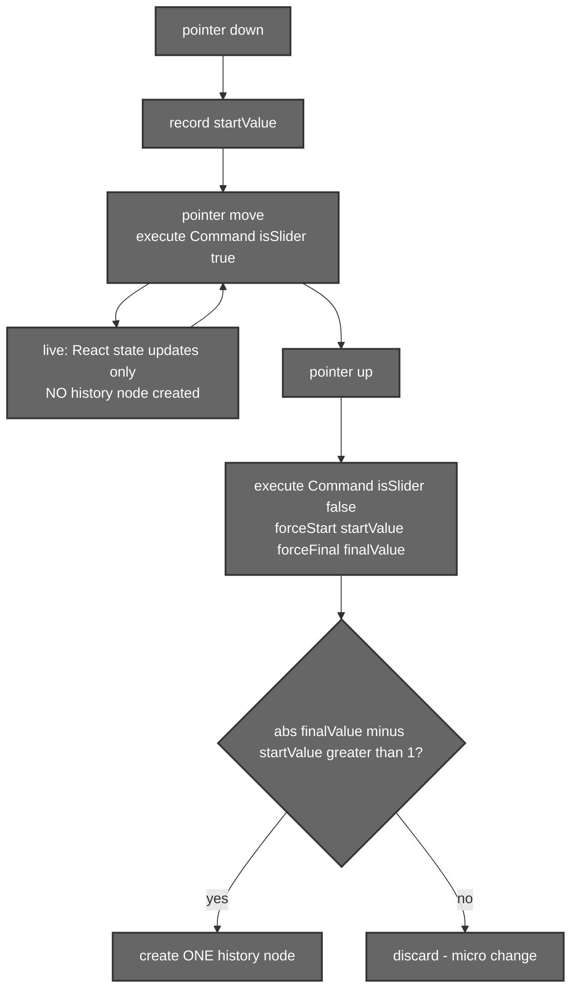

# Basic Edits, the LUT Engine & Undo/Redo

## 1. Introduction

This document covers the everyday editing controls — **brightness, contrast,
saturation, blur, hue, sharpen, opacity, rotation, flip** — and the **LUT
(Look‑Up Table) colour‑grading engine** that powers Aurora's 35 cinematic
presets. It also explains how every one of these edits flows through the
**Command pattern** into the undo/redo history.

The guiding principle: a slider or button never mutates pixels directly. It
produces a `Command` (a `do`/`undo` pair) that updates `editorState`; the
[Canvas](./01-canvas-rendering.md) then re‑renders from that state. This keeps
edits non‑destructive and makes undo/redo trivial.

---

## 2. Files that hold the logic

| File | Responsibility |
|------|----------------|
| `src/components/MainEditor/Utils/LUTUtils.js` | The LUT engine: `parseCubeLUT` (parse `.CUBE` text), `applyLUT` (per‑pixel trilinear interpolation), `getAvailableLUTs` (the 35 presets). |
| `src/components/SegmentEditor/UI/EditSlider.jsx` | The slider UI. Turns a pointer drag into `Command`s and calls `execute(...)` with the slider‑debounce flags. |
| `src/components/MainEditor/UI/EditorMenu.jsx` | The adjustment menu and the buttons that trigger filters, transforms and the AI colour grade. |
| `src/components/MainEditor/UI/Canvas.jsx` | Consumes `editorState` + the loaded LUT and renders (see [01](./01-canvas-rendering.md)). |
| `src/hooks/useHistory.jsx` | The Command executor + undo/redo (full tree detail in [03](./03-history.md)). |
| `public/luts/*.CUBE` | The 35 colour‑grading preset files. |

---

## 3. Basic edits

### 3.1 The adjustments

| Adjustment | Range | Unit | Neutral | How it renders |
|-----------|-------|------|---------|----------------|
| Brightness | 0–200 | % | **100** | CSS `brightness()` |
| Contrast | 0–200 | % | **100** | CSS `contrast()` |
| Saturation | 0–200 | % | **100** | CSS `saturate()` |
| Blur | 0–20 | px | **0** | CSS `blur()` (applied at draw time) |
| Hue | 0–360 | deg | **0** | CSS `hue-rotate()` |
| Sharpen | 0–100 | – | **0** | Extra `contrast(100+sharpen)` boost |
| Opacity | 0–100 | % | **100** | `ctx.globalAlpha` |
| Rotation | 0–360 | deg | **0** | Canvas `rotate()` |
| Flip H / V | on/off | bool | **false** | Canvas `scale(-1,1)` / `scale(1,-1)` |

The **neutral = 100** convention (for the percentage adjustments) matters: it
is why the [predictive grade](./05-color-grading.md) fits *absolute*
percentages around 100 rather than additive deltas.

### 3.2 Slider → Command → history

A slider drag has a lifecycle so that the *entire drag* collapses into a single
undo step instead of hundreds:



In code, every edit is expressed as a `Command`:

```js
// brightness slider, live frame:
execute(new Command(
  (s) => ({ ...s, brightness: value }),   // do
  (s) => s,                               // undo (no-op while dragging)
), true);                                 // isSliderCommand = true → no node

// on release, commit one node:
execute(new Command(
  (s) => ({ ...s, brightness: finalValue }),
  (s) => ({ ...s, brightness: startValue }),
), false, startValue, finalValue);        // creates a node if the change > 1
```

The same `Command(do, undo)` shape is used everywhere — transforms, LUT
selection, reset, AI edits — which is exactly what lets a single undo/redo
implementation handle all of them.

### 3.3 Undo / redo

Undo/redo are thin wrappers over the history tree (detailed in
**[03 – History](./03-history.md)**):

- **Undo** moves the current pointer to the node's **parent** and restores that
  node's complete `state` snapshot.
- **Redo** moves to the node's **first child**.
- Because every node stores a *full* state object, restoring is just
  `setState(node.state)` — no need to replay `do`/`undo` chains.

Keyboard shortcuts: `Ctrl/Cmd+Z` (undo), `Ctrl+Y` / `Cmd+Shift+Z` (redo).

---

## 4. The LUT engine

### 4.1 What a LUT is

A **3D LUT** is a colour cube that maps every input RGB to an output RGB. Aurora
uses the standard `.CUBE` format at size 33 (33³ = 35 937 colour samples). They
live in `public/luts/` — 35 cinematic presets (Arabica 12, Ava 614, Azrael 93,
Bourbon 64, …).

```
LUT_3D_SIZE 33
DOMAIN_MIN 0.0 0.0 0.0
DOMAIN_MAX 1.0 1.0 1.0
0.000000 0.000000 0.000000
0.031373 0.027451 0.023529
...        (35 937 RGB rows, normalised 0–1)
```

### 4.2 Parsing and applying


**`parseCubeLUT(text)`** skips comments/`DOMAIN_*`, reads `LUT_3D_SIZE`, and
collects the RGB rows into `{ size, data: [[r,g,b], …] }`.

**`applyLUT(imageData, lut)`** walks every pixel. Because a pixel's colour
rarely lands exactly on a grid point, it does **trilinear interpolation** across
the 8 surrounding cube corners. The flat‑array index for a grid point is:

```
index = (r + g * size + b * size²) * 3      // *3 because each entry is R,G,B
```

This same index convention is what makes the AI LUTs
([05 – Colour Grading](./05-color-grading.md)) drop straight into this engine —
their fused cubes use an identical `r + g·N + b·N²` layout.

For speed, `applyLUT` caches a `Float32Array` copy of the LUT (`lut._flat`) so
the per‑pixel loop avoids re‑reading nested arrays.

### 4.3 How a LUT is selected

`editorState.selectedLUT` takes one of two shapes:

- **Preset:** `{ name, file }` → the Canvas/HistoryViewer fetches
  `/luts/<file>` and parses it (parsed results are cached per file).
- **Adaptive (AI):** `{ name, file, adaptive: true, adaptiveId }` → the heavy
  cube is *not* stored in history; it lives in the in‑memory
  `adaptiveLutStore` singleton and is resolved by `adaptiveId`. This keeps
  history snapshots small. See [05](./05-color-grading.md).

---

## 5. Models used

**None for basic edits or `.CUBE` LUTs** — this is all CSS filters + Canvas 2D
maths. The *adaptive* LUTs are produced by client‑side ONNX models documented in
**[05 – AI Colour Grading](./05-color-grading.md)**; they merely reuse the
`applyLUT` engine described here to render.

---

## 6. Summary

- Every edit is a `Command(do, undo)` that updates `editorState`; the Canvas
  renders from state, so editing stays non‑destructive.
- Slider drags collapse to a single history node via the
  `isSlider → forceStart/forceFinal` debounce, with a `> 1` change threshold.
- Undo/redo restore whole state snapshots from the history tree.
- The LUT engine parses `.CUBE` files and applies them with trilinear
  interpolation; the `r + g·N + b·N²` index convention is shared by the AI
  colour models.
