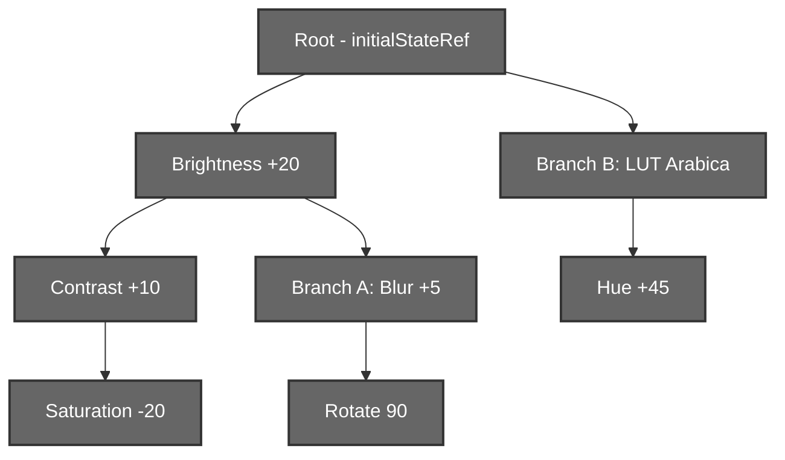
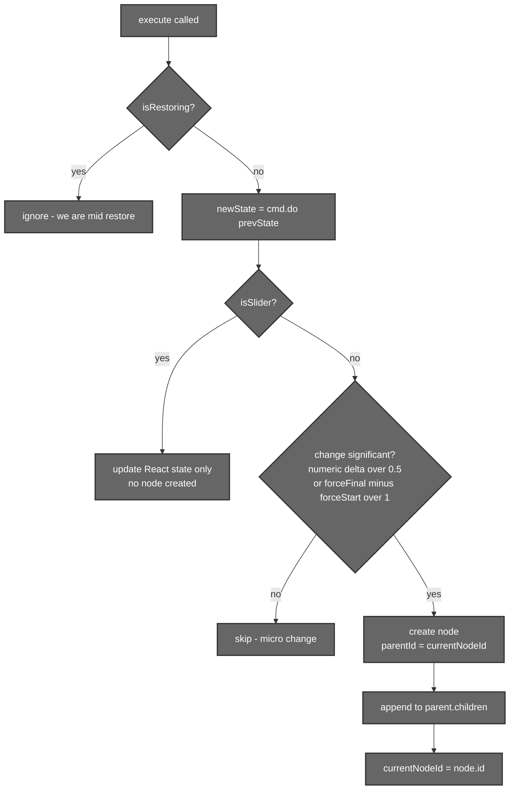

# History System (Tree‑Based Undo / Redo / Branching)

## 1. Introduction

Aurora's history is **not** a linear undo stack. It is a **tree**: every edit
becomes a node, and editing from an earlier point creates a *branch* instead of
destroying the future. Nothing is ever lost — you can explore "what if I'd gone
warmer here?" without throwing away the cooler version. The
[HistoryViewer](#5-the-historyviewer) renders this tree as thumbnails so you can
jump anywhere instantly.

Every node stores a **complete snapshot** of `editorState` (including the base
`srcImage`), so restoring a state is a single assignment — there is no need to
replay a chain of `do`/`undo` operations.

---

## 2. Files that hold the logic

| File | Responsibility |
|------|----------------|
| `src/hooks/useHistory.jsx` | The whole engine: the node tree, `execute`, `undo`, `redo`, `jumpToNode`, `addBranch`, `reset`, `patchCurrentState`, slider debouncing, branch dedup. |
| `src/utils/historyParser.js` | `parseHistory` (enrich the raw tree for the UI), `generateLabel` (human‑readable node labels), `getPathToNode`. |
| `src/components/MainEditor/UI/HistoryViewer.jsx` | Visual browser: thumbnail generation from each node's `srcImage` + filters/LUT, branch columns, the "AI optimize" button. |

---

## 3. Data structures

### 3.1 The Command

```js
class Command {
  constructor(doFn, undoFn) {
    this.do = doFn;     // (prevState) => newState
    this.undo = undoFn; // (prevState) => previousState
  }
}
```

### 3.2 The node

```js
{
  id:        number,           // monotonic, from nextId
  command:   Command,          // the do/undo that produced this node
  parentId:  number | null,    // null = a root-level node
  children:  number[],         // child ids → this is what makes branches
  state:     object,           // FULL editorState snapshot (incl. srcImage)
  timestamp: number,
  label:     string | null,    // optional; generateLabel fills the gaps
}
```

The tree is stored in **refs** (`historyTree`, `currentNodeId`, `nextId`,
`initialStateRef`) rather than React state, so adding nodes doesn't trigger
re‑renders. Only the *current* `editorState` lives in React state.

---

## 4. How it works



### 4.1 `execute(cmd, isSlider, forceStart, forceFinal, label)`

The single entry point for all edits.



Key behaviours:

- **Slider coalescing** — while `isSlider` is true, only React state updates; no
  node is created. On release the caller passes `forceStart`/`forceFinal` so a
  single node captures the whole drag (threshold: change `> 1`).
- **Implicit branching** — a new node always sets `parentId = currentNodeId`.
  If you've undone to an earlier node and then edit, that earlier node simply
  gains another child → a new branch, and the old future is preserved.
- **`isRestoring` guard** — set during undo/redo/jump so restoring a state can't
  recursively spawn new nodes.

### 4.2 Traversal

| Operation | Movement | Restores |
|-----------|----------|----------|
| `undo()` | → `parentId` (or root `initialStateRef` if parent is null) | parent's `state` |
| `redo()` | → `children[0]` (first branch) | child's `state` |
| `jumpToNode(id)` | → any node directly | that node's `state` |

All three set `isRestoring` around the `setState`, and clear any pending slider
debounce first.

### 4.3 `addBranch(newState, label)` — explicit branching

Used by the AI features (predictive grade) to add a sibling branch from the
current node. It includes **deduplication**: before creating a node it scans the
current node's existing children and, if one already holds an effectively equal
state (numeric tolerance `±1`, exact match otherwise), it **reuses** that child
instead of creating a duplicate. It returns the node id so the caller (e.g.
HistoryViewer) can immediately select the new branch.

### 4.4 `reset` vs `patchCurrentState`

Two special operations bypass the normal "add a node" flow:

- **`reset(newRootState)`** — wipes the tree and starts fresh with a new root.
  Used when a brand‑new base image arrives: loading a new photo, or applying a
  segment **onto an imported background** (which is intentionally *not* an
  undoable step — it begins a new editing session).
- **`patchCurrentState(patch)`** — merges a patch into the *current* node's
  state in place, creating **no** node. Used for the post‑segmentation
  downscale swap, where the working image is replaced by the exact blob the
  backend segmented (see [04 – Segmentation](./04-segmentation.md)) without
  polluting history.

> The base image is tracked **inside** history as `editorState.srcImage`. An
> effect in `Editor.jsx` mirrors it to `uploadedImage`, so undo/redo/jump
> restore the correct image automatically. Named `srcImage` (not `baseImage`)
> because `baseImage` is reserved for the predictive grader's transient
> `ImageData`.

---

## 5. The HistoryViewer

`HistoryViewer.jsx` turns the tree into a browsable, thumbnailed UI.


- **`parseHistory`** prepends a synthetic "Initial State" node and annotates
  each node with `depth`, `branchIndex` and `isCurrent`. It prefers a node's
  explicit `label`; otherwise `generateLabel` derives one from non‑neutral
  values, e.g. *"Brightness: 120%, Contrast: 110%…"*, *"LUT: Arabica 12"*,
  *"Cropped"*, *"AI edit"*.
- **Thumbnails** are generated per node from `node.state.srcImage`, applying the
  same LUT + filters the main canvas would, then cached (`thumbsRef`) and
  re‑used. Parsed `.CUBE` LUTs are cached in `lutCache` to avoid re‑parsing.
- **AI optimize** runs the predictive colour branch and calls `addBranch` with a
  descriptive label (e.g. *"AI Optimized (NeurOp (ONNX) + Deep‑WB)"*) — see
  [05 – Colour Grading](./05-color-grading.md).

---

## 6. Models used

**None.** The history system is pure data‑structure + Canvas thumbnailing. It
*hosts* AI results (the predictive grade adds branches here) but contains no
model itself.

---

## 7. Summary

- A **tree of full‑state snapshots**, stored in refs, makes undo/redo/jump O(1)
  and never loses a branch.
- `execute` handles slider coalescing, micro‑change rejection and implicit
  branching through one code path.
- `addBranch` (with dedup) is the explicit‑branch entry used by AI features;
  `reset`/`patchCurrentState` handle base‑image changes that shouldn't be normal
  undo steps.
- `HistoryViewer` thumbnails every node from its `srcImage` and renders the tree
  for one‑click time travel.
