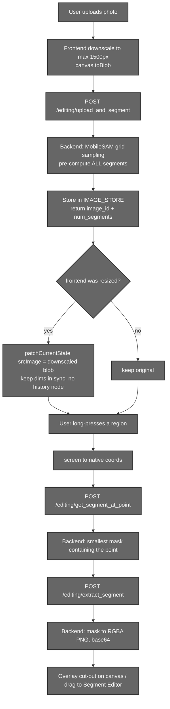
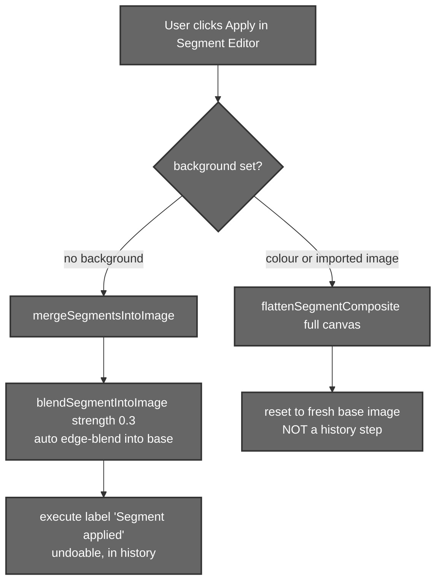

# Segmentation (Selection, Erase & Merge)

## 1. Introduction

Segmentation lets a user **tap any object in the photo** and pull it out as its
own editable layer. Aurora runs **MobileSAM** on the backend to pre‑compute
every segment in an image, then serves individual cut‑outs (transparent PNGs) on
demand. Those cut‑outs can be edited in isolation in the
[Segment Editor](#6-the-segment-editor), cleaned up with a **lasso eraser**, and
finally **merged back** into the photo with an automatic edge‑blend — or composited
onto a brand‑new background.

The subsystem spans the FastAPI backend (the model + masks) and the React
frontend (selection, editing, blending, merge).

---

## 2. Files that hold the logic

### Backend

| File | Responsibility |
|------|----------------|
| `backend/Routers/segmentation.py` | All segmentation endpoints, MobileSAM loading, grid sampling, the `IMAGE_STORE` LRU cache, point→segment lookup, segment extraction. |
| `backend/segmentation_inpainting/utils.py` | `extract_object_with_transparency` (mask → RGBA), `encode_image_to_base64`. |
| `backend/segmentation_inpainting/mobile_sam.pt` | The MobileSAM `vit_t` checkpoint. |
| `backend/main.py` | Mounts the segmentation router. |

### Frontend

| File | Responsibility |
|------|----------------|
| `src/components/MainEditor/Utils/SegmentationAPI.js` | Upload (with 1500 px downscale + `toBlob`), `getSegmentAtPoint`, `extractSegment`. |
| `src/components/MainEditor/UI/Canvas.jsx` | Long‑press to select, screen→native coordinate transform, segment overlay drawing/drag. |
| `src/components/MainEditor/UI/Editor.jsx` | `handleSegment` (upload + dimension swap), the merge/apply routing, crop. |
| `src/components/SegmentEditor/UI/SegmentEditor.jsx` | Segment editing canvas, the lasso eraser, `flattenSegmentComposite`. |
| `src/components/MainEditor/Utils/segmentBlend.js` | The classical auto edge‑blend (Reinhard colour transfer + feather + colour bleed). |

---

## 3. End‑to‑end workflow



---

## 4. The backend pipeline

### 4.1 Endpoints

All under the router prefix `/editing` and JWT‑protected:

| Method | Path | Takes | Returns |
|--------|------|-------|---------|
| `POST` | `/editing/upload_and_segment` | `file` (multipart image) | `{ success, image_id, size:[H,W,C], num_segments }` |
| `POST` | `/editing/get_segment_at_point` | `{ image_id, x, y }` | `{ success, has_segment, segment_index? }` |
| `POST` | `/editing/extract_segment` | `{ image_id, segment_index }` | `{ success, object_base64, size:[W,H], bbox:[x,y,w,h] }` |
| `POST` | `/editing/clear_memory` | – | `{ message }` |
| `GET` | `/editing/health` | – | `{ status, device, model_loaded, cuda_available, … }` |

**`IMAGE_STORE`** is an `OrderedDict` LRU capped at `MAX_STORED_IMAGES = 20`.
Each entry holds the processed `image` (numpy), its `shape`, and the list of
pre‑computed `segments`. Oldest entries are evicted when full (it was previously
an unbounded memory leak).

### 4.2 Grid sampling

On upload, MobileSAM doesn't wait for clicks — it segments **everything up
front** by probing a grid of foreground points. The grid density scales with
image area (24×24 for small images up to 40×40 for >2000 px), each point
producing one mask via `predictor.predict(..., multimask_output=False)`. Masks
are de‑duplicated by hashing (`hash(mask.tobytes())`), filtered to `area > 100`
px, and sorted largest‑first.

### 4.3 Point lookup & extraction

- **`get_segment_at_point`** clamps `(x, y)` to bounds and returns the
  **smallest** (finest) segment whose mask is true at that pixel — so tapping a
  shirt picks the shirt, not the whole person.
- **`extract_segment`** builds an RGBA image where the alpha channel = `mask *
  255` (`extract_object_with_transparency`), encodes it as a base64 PNG data
  URL, and returns it with its bbox.

---

## 5. The coordinate‑sync contract

This is the subtle, critical rule of the whole subsystem:

> **The frontend `uploadedImage` dimensions must equal the backend's stored
> (processed) image dimensions**, because tap coordinates are sent in
> *processed‑image space*.

- The frontend caps uploads at **1500 px** (`SEGMENT_MAX_DIM`) and sends the
  downscaled blob; the backend's own **2048 px** cap therefore never triggers.
- If the frontend resized the image, `handleSegment` swaps the on‑screen working
  image for that **exact downscaled blob** (reusing the same `Blob` via object
  URL — no base64 round‑trip) using `patchCurrentState({ srcImage })`, which
  changes the image *without* adding a history node.
- Result: when the user taps, screen→native coordinates index the *same* pixel
  grid the backend segmented. Change one cap without the other and taps select
  the wrong segment.

---

## 6. The Segment Editor

Once a cut‑out is dragged in, `SegmentEditor.jsx` provides a full editing
surface for that single object: the same adjustments and LUTs as the main
editor, scale/position, a choice of **background** (solid colour, uploaded
image, or transparent), the **lasso eraser**, and `flattenSegmentComposite`
which renders the final result.

### 6.0 The cut‑out workspace (managing multiple segments)

You can pull several objects into the editor at once. `GalleryView.jsx` shows
all `editedObjects` as a thumbnail grid (each with its `name` and native
`width × height`), and lets you:

- **Select** a cut‑out to edit it (switches to the edit view),
- **Duplicate** it (`duplicateObject`) to make a variant, and
- **Delete** it (`deleteObject`).

So segmentation isn't one‑object‑at‑a‑time: it's a small workspace of cut‑outs,
any of which can be edited, composited onto a background, and applied or
exported independently.

### 6.1 The lasso eraser

Draw a closed loop over part of the cut‑out to delete it (e.g. trim a stray
arm):

```mermaid
flowchart LR
    A[pointer drag on wrapper div]:::dark --> B[collect screen points]:::dark
    B --> C[red dashed preview overlay]:::dark
    C --> D[pointer up: commitErase]:::dark
    D --> E[screenToNative: invert flip/rotate/zoom/pan]:::dark
    E --> F[trace smooth path, feather 0.6 to 2px]:::dark
    F --> G[destination-out onto segment]:::dark
    G --> H[execute Command - undoable]:::dark

    classDef dark fill:#666666,color:#ffffff,stroke:#333333,stroke-width:2px
```



Implementation notes that were hard‑won:
- Pointer handlers live on the **wrapper div**, and both canvases are
  `pointer-events-none`, so the preview overlay can't swallow input.
- `screenToNative` inverts the *full* render transform (zoom, pan, flip,
  rotation) so the erased region lands exactly under the cursor at native
  resolution.
- The erase is applied with `globalCompositeOperation = 'destination-out'` and a
  small feather (0.6–2 px) for clean, sharp cuts even on small chunks. It's an
  undoable `Command`.

### 6.2 The export‑resolution gotcha

A segment's `image` is a **full‑frame PNG at the main photo's native
resolution** (it was created in `Canvas.dragSegments` with
`canvas.width = uploadedImage.width`). But `obj.width` is only the small
*display* width. So when `flattenSegmentComposite` exports onto a colour or
transparent background it must scale the output up to the segment's true
resolution, not the display size:

```js
const nativeW  = obj.image.naturalWidth || obj.image.width;
const ideal    = imgWvp > 0 ? nativeW / imgWvp : 1;       // scale-up factor
const maxByDim = Math.max(1, 6000 / Math.max(cw, ch));    // ~6000px safety cap
const mapScale = Math.max(1, Math.min(ideal, maxByDim));
```

Targeting `obj.width` instead (a past bug) downscaled to ~0.6× and visibly
blurred small segments. When the background is an **image**, the output is
sized to the background's native resolution and the segment is mapped through
the viewport→native transform.

---

## 7. Merge / apply back into the photo

`flattenSegmentComposite` is used for download/save inside the segment editor;
applying back to the **main** photo routes through `Editor.jsx` two ways:



- **No background** → the segment is blended into the existing photo at its
  position and committed as an undoable history node labelled *"Segment
  applied"*.
- **Any background** (solid colour *or* an imported image) → the result is a new
  composition, so Aurora `reset`s to it as a fresh base (a new editing session,
  intentionally not an undo step).

### 7.1 The automatic edge‑blend (`segmentBlend.js`)

When a segment is applied with **no** new background, Aurora harmonises its
colours to the surroundings so it doesn't look pasted on. This is **classical
canvas maths — there is no AI model here** (an earlier plan for a deep
harmonisation network was dropped as overkill):

1. **`colorBleed`** — extend the segment's *interior* colours outward a couple
   of pixels to decontaminate the matte edge (kills the dark fringe that
   appears against e.g. a black background).
2. **`erodeMask` + `cleanEdge`** — inset the alpha by ~1–2 px and apply a
   **tight ~1 px anti‑alias** (a feather, *not* a fat blur halo).
3. **`channelStats` + `applyTransfer`** — a **Reinhard mean/std colour
   transfer**: `out = (in − segMean) · ratio + refMean`, with the std ratio
   clamped to `[0.6, 1.6]` so a flat background can't crush the segment.
4. **`blendSegmentIntoImage`** is *position‑aware*: it samples a ring of
   background pixels around the segment's alpha bounding box (needs ≥ 50
   samples) and harmonises toward those, at strength `0.3`.

Feather/shrink/bleed are auto‑scaled to the image's min dimension
(`feather 0.75–1.5 px`, `shrink 1–2 px`, `bleed 2–6 px`).

### 7.2 Re‑segmentation

After a merge, the old segment map is invalid, so `segmentationImageId` is
cleared. Tapping **Segment** again re‑uploads the merged result and MobileSAM
re‑computes a fresh map for continued editing.

---

## 8. Models used

| Model | Where | What it does |
|-------|-------|--------------|
| **MobileSAM** (`vit_t`) | Backend, local | Pre‑computes every object mask from a grid of prompt points. |

### Model detail — MobileSAM

| Property | Value |
|----------|-------|
| Name | MobileSAM (Faster Segment Anything) |
| Backbone | `vit_t` — a distilled Tiny ViT image encoder (~5M params vs SAM's ~600M ViT‑H) |
| Checkpoint | `backend/segmentation_inpainting/mobile_sam.pt` |
| Loaded via | `mobile_sam.sam_model_registry["vit_t"]` → `SamPredictor` |
| Prompt | Point grid (24×24 → 40×40 by area), `multimask_output=False` |
| Filters | dedup by mask hash, `area > 100` px, sorted largest‑first |
| Device | CUDA if available, else CPU; calls guarded by a thread lock |
| Repo | <https://github.com/ChaoningZhang/MobileSAM> |
| Paper | *Faster Segment Anything: Towards Lightweight SAM for Mobile Applications* (Zhang et al., 2023) |

The **lasso eraser** and **auto edge‑blend** use **no model** — they are pure
Canvas 2D operations.

---

## 9. Summary

- MobileSAM (`vit_t`) pre‑segments the whole image on upload; cut‑outs are
  served on demand as transparent PNGs.
- The 1500 px frontend cap + dimension swap keeps tap coordinates aligned with
  the backend's processed image — the core correctness contract.
- The Segment Editor adds isolated editing, an undoable lasso eraser, and a
  resolution‑correct export.
- Applying with no background runs a classical Reinhard auto edge‑blend (no AI)
  and is undoable; applying onto a background starts a fresh base image.
