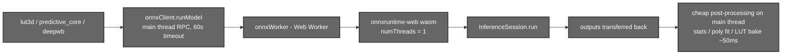
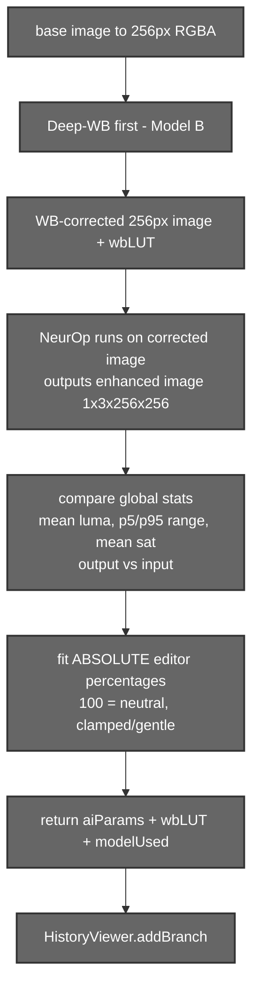
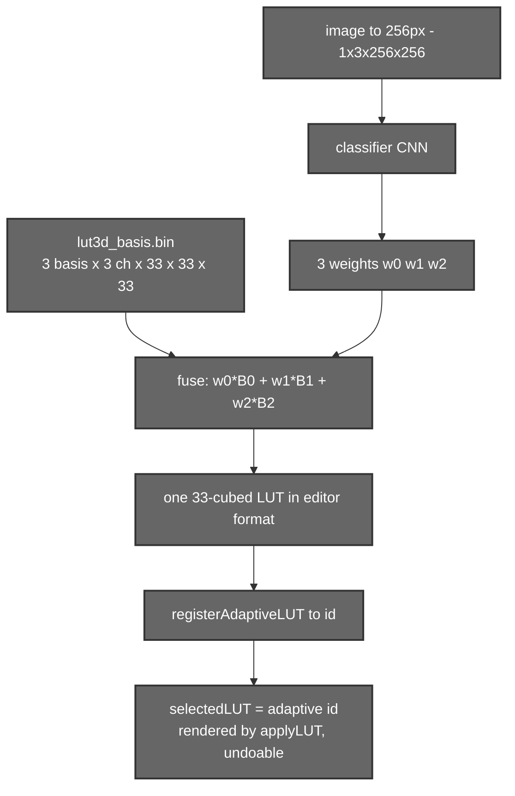

# AI Colour Grading (Client‑Side ONNX)

## 1. Introduction

Aurora ships **three neural colour models that run entirely in the browser** via
ONNX Runtime Web — no server, no GPU, no upload. They power two user‑facing
features:

- **"AI color grade"** (the Wand2 button in the editor menu) → **Model C**, an
  Image‑Adaptive 3D LUT that picks a content‑aware grade.
- **"AI optimize"** (in the History viewer) → **Model A (NeurOp)** for tone
  plus **Model B (Deep White‑Balance)** for colour cast, fitted into a new
  history branch.

All inference happens in a dedicated **Web Worker** so the heavy U‑Nets never
freeze the UI. Each model's output is funnelled back into the editor's existing
[LUT engine](./02-edits-and-luts.md) and [history](./03-history.md), so the
results are non‑destructive, undoable and full‑resolution.

---

## 2. Files that hold the logic

| File | Responsibility |
|------|----------------|
| `src/components/ColorGradingUtils/lut3d.js` | **Model C** — Image‑Adaptive 3D LUT: `getAdaptiveLUT(image)` runs the classifier and fuses the basis cubes. |
| `src/components/ColorGradingUtils/predictive_core.js` | **Model A** — NeurOp predictive tone: `infer` / `runPredictiveBranch`, stat‑fitting, the `gradeFromStats` fallback. |
| `src/components/ColorGradingUtils/deepwb.js` | **Model B** — Deep White‑Balance: runs the AWB U‑Net, fits an 11‑term polynomial, bakes a 33³ LUT. |
| `src/components/ColorGradingUtils/onnxWorker.js` | The **only** file importing `onnxruntime-web`. Generic runner: `modelUrl + NCHW Float32Array → outputs`. |
| `src/components/ColorGradingUtils/onnxClient.js` | Main‑thread RPC to the worker (`runModel`, 60 s timeout). |
| `src/components/ColorGradingUtils/adaptiveLutStore.js` | In‑memory singleton holding the heavy AI LUTs by id, so history snapshots stay small. |
| `src/components/MainEditor/UI/EditorMenu.jsx` | The "AI color grade" trigger → `handleAIColorGrade`. |
| `src/components/MainEditor/UI/HistoryViewer.jsx` | The "AI optimize" trigger → `runPredictiveBranch` → `addBranch`. |
| `public/models/*.onnx`, `public/models/lut3d_basis.bin` | The model weights and basis data. |

---

## 3. The ONNX worker plumbing

- `onnxWorker.js` is the single owner of `onnxruntime-web`. It caches one
  `InferenceSession` per model URL, runs on the `wasm` execution provider with
  `numThreads = 1` (avoids `SharedArrayBuffer`), and transfers output buffers
  back.
- `onnxClient.js` provides `runModel(url, inputData, dims)` as a promise with a
  60‑second timeout and surfaces worker‑startup failures as a toast.
- **Vite quirk (do not "fix"):** `vite.config.js` sets
  `optimizeDeps.exclude: ['onnxruntime-web']` and `server.fs.allow: ['..']`. The
  ORT `.mjs`/`.wasm` are served straight from `node_modules`; **do not** set
  `ort.env.wasm.wasmPaths` and **do not** copy ORT wasm into `/public` (Vite
  forbids importing the glue `.mjs` from there). The model weights *do* live in
  `/public/models` — that's fine, they're fetched, not imported.

---

## 4. Model A — NeurOp (predictive tone)

**Feature:** "AI optimize" in the History viewer. Produces gentle, image‑aware
brightness/contrast/saturation as a new branch.

How it works:
- The model **outputs an enhanced image** `[1,3,256,256]` (plus a few operator
  scalars). `predictive_core` selects the 4‑D, 3‑channel image output (ignoring
  `onnx::`‑prefixed scalar outputs).
- Rather than trust the model's raw pixels, it **compares global statistics** of
  the model's output vs the input — mean luma (`0.299R+0.587G+0.114B`), the
  p5/p95 tonal range, mean saturation — and fits **absolute** editor percentages
  around the neutral 100 (`gradeFromReference`), clamped to gentle ranges
  (brightness ~70–150, contrast ~80–145, saturation ~80–145).
- White balance runs **first** so the tone fit happens on the colour‑corrected
  image, matching the editor's LUT→filters render order.
- If the model can't load, a deterministic `gradeFromStats` auto‑grade runs from
  the image's own statistics, so the feature degrades gracefully.

It returns `{ aiParams: { brightness, contrast, saturation }, wbLUT, isAI,
modelUsed }`. `HistoryViewer` registers `wbLUT` in the adaptive‑LUT store, sets
the branch's `selectedLUT`, and calls `addBranch`.

> **Design note:** This was rewritten because the original read the output
> *image pixels* as if they were brightness/contrast params and applied a random
> film LUT — it almost always looked worse. The current stat‑fit approach is
> intentionally subtle.

### Model detail — NeurOp

| Property | Value |
|----------|-------|
| File | `public/models/neurop_lite.onnx` (~143 KB) |
| Input | `[1, 3, 256, 256]` NCHW Float32, 0–1 |
| Output | enhanced image `[1, 3, 256, 256]` (+ operator scalars) |
| Idea | Neural Colour Operators — learnable brightness/exposure/colour operators |
| Repo | <https://github.com/amberwangyili/neurop> |
| Paper | *Neural Color Operators for Sequential Image Retouching* (Wang et al., ECCV 2022) |

---

## 5. Model B — Deep White‑Balance

**Feature:** runs as part of "AI optimize" to remove colour casts.

The AWB U‑Net outputs a *corrected image*, not a per‑channel temperature — so a
simple temperature slider can't represent it (a direct attempt came out green).
Instead `deepwb.js`:

1. Runs the net on the 256 px image → corrected RGBA.
2. **Fits the repo's 11‑term polynomial RGB→RGB mapping** from input→corrected
   (`[r, g, b, rg, rb, gb, r², g², b², rgb, 1]`) by solving a small least‑squares
   system.
3. **Bakes that polynomial into a 33³ LUT** in the editor's
   `{ size:33, data:[[r,g,b]…] }` format.

So the white‑balance correction flows through the same LUT engine as everything
else and is fully undoable.

### Model detail — Deep White‑Balance

| Property | Value |
|----------|-------|
| Files | `public/models/deepwb_awb.onnx` (~17.5 MB) |
| Type | Single‑task AWB (auto white‑balance) U‑Net |
| Input | `[1, 3, 256, 256]` NCHW Float32, 0–1 |
| Output | corrected image `[1, 3, 256, 256]` → fitted to an 11‑term poly → 33³ LUT |
| Repo | <https://github.com/mahmoudnafifi/Deep_White_Balance> |
| Paper | *Deep White‑Balance Editing* (Afifi & Brown, CVPR 2020) |

---

## 6. Model C — Image‑Adaptive 3D LUT

**Feature:** the manual **"AI color grade"** (Wand2). A tiny CNN looks at the
image and predicts how to **blend three learned basis LUTs** into one grade
tailored to that photo.

`getAdaptiveLUT(image)` runs the classifier and the basis load in parallel,
reads the 3 weights, and fuses the basis cubes index‑by‑index. The basis layout
is `[3 basis][3 channel][33][33][33]` (`c,B,G,R`), and the editor's
`r + g·N + b·N²` index maps **1:1** onto it, so the fused cube drops straight
into `applyLUT`. The result is registered in `adaptiveLutStore`, and
`editorState.selectedLUT = { adaptive: true, adaptiveId }` references it without
bloating history.

### Model detail — Image‑Adaptive 3D LUT

| Property | Value |
|----------|-------|
| Files | `lut3d_classifier.onnx` (1.08 MB) + `lut3d_basis.bin` (1.29 MB) |
| Classifier I/O | `[1,3,256,256]` → 3 weights `[1,3,1,1]` |
| Basis | Float32 `[3 basis][3 ch][33][33][33]`, layout `c,B,G,R` |
| Output | one fused 33³ LUT, `{ size:33, data:[[r,g,b]…] }` |
| Repo | <https://github.com/HuiZeng/Image-Adaptive-3DLUT> |
| Paper | *Learning Image‑Adaptive 3D LUTs for High Performance Photo Enhancement in Real‑Time* (Zeng et al., TPAMI 2020) |

> These ONNX/basis artifacts were exported from the authors' PyTorch weights and
> validated to match the original to ~1e‑7.

---

## 7. The shared LUT store

`adaptiveLutStore.js` is a tiny singleton:
`registerAdaptiveLUT(lut) → id`, `getAdaptiveLUTById(id)`,
`clearAdaptiveLUTs()`. Both the manual grade (Model C) and the predictive
grade's WB LUT (Model B) register here, and `Editor`'s LUT‑load effect resolves
`adaptive` LUTs from it instead of fetching a `.CUBE`. Loading a new image
clears the store.

---

## 8. Summary

| | Model A — NeurOp | Model B — Deep‑WB | Model C — Adaptive 3D LUT |
|---|---|---|---|
| Trigger | "AI optimize" (history) | part of "AI optimize" | "AI color grade" (Wand2) |
| Output | brightness/contrast/saturation % | 33³ WB LUT | 33³ content LUT |
| Size | ~143 KB | ~17.5 MB | 1.08 MB + 1.29 MB |
| Repo | amberwangyili/neurop | mahmoudnafifi/Deep_White_Balance | HuiZeng/Image-Adaptive-3DLUT |

- All three run **client‑side** in a Web Worker; results reuse the editor's LUT
  engine and history, so they're non‑destructive and undoable.
- NeurOp is fit from *statistics* (not raw pixels) for subtle, reliable grades,
  with a deterministic fallback.
- Distinct from the **remote** Qwen editor — see
  [06 – Qwen AI Editing](./06-qwen-inpainting.md).
