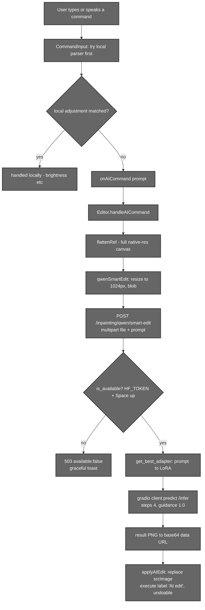

# Qwen AI Editing (Remote Inpainting / Relight)

## 1. Introduction

Aurora's most powerful editing feature is **natural‑language image editing** —
type or say *"put this on a beach at sunset"* or *"relight as golden hour"* and a
**Qwen‑Image‑Edit‑2509** diffusion model rewrites the picture. Because this model
is far too large for a typical laptop GPU, it runs as **remote inference on a
HuggingFace Space**; Aurora's backend is a thin, gated proxy in front of it.

This is the one feature that *leaves the device*. Everything else (segmentation,
LUTs, colour grading, history) runs locally. The whole path degrades gracefully:
if there's no `HF_TOKEN`, or the Space is down, the user gets a friendly "AI
editing isn't available" toast and the rest of the editor keeps working.

> **Status:** the plumbing is complete and correct, but the public
> `team39/qwen-relight-2509` Space it targets may no longer be live. When it's
> unreachable the endpoints return `available: false` and the feature is simply
> unavailable — nothing else breaks.

---

## 2. Files that hold the logic

| File | Responsibility |
|------|----------------|
| `backend/segmentation_inpainting/hf_qwen_space.py` | The HF Space client: lazy `_init_client()`, `is_available()`, `get_best_adapter()` (prompt→LoRA routing), `smart_edit()` (the gradio call). |
| `backend/Routers/inpainting.py` | Two endpoints: `GET /inpainting/qwen/status` and `POST /inpainting/qwen/smart-edit`. |
| `src/components/MainEditor/Utils/AIEditAPI.js` | `qwenSmartEdit(image, prompt)` — image→blob (max 1024 px), multipart POST, base64 result. |
| `src/components/MainEditor/UI/CommandInput.jsx` | Decides a command is an **AI** command (not a local adjustment) and calls the `onAICommand` prop. |
| `src/components/MainEditor/UI/Editor.jsx` | `handleAICommand`: flattens the canvas, calls `qwenSmartEdit`, applies the result via `applyAIEdit` (history label *"AI edit"*). |
| `src/components/SegmentEditor/UI/SegmentEditor.jsx` | Wires `onAICommand` too, so AI editing also works on a single segment composite. |

---

## 3. End‑to‑end workflow



---

## 4. The backend proxy

### 4.1 Lazy client + availability

`_init_client()` reads `HF_TOKEN` from the environment; if it's missing it
returns `None` (feature off). Otherwise it constructs a cached
`gradio_client.Client(HF_SPACE, token=HF_TOKEN)`. The target Space is
configurable: `HF_SPACE` defaults to **`team39/qwen-relight-2509`**.
`is_available()` is simply `_init_client() is not None`.

### 4.2 Prompt → LoRA routing

A single base model is specialised by **LoRA adapters**. `get_best_adapter`
keyword‑matches the prompt to pick the right one:

| Adapter | Trigger keywords |
|---------|------------------|
| `Next-Scene` | background, scene, environment, setting, place |
| `Relight` *(default)* | light, lighting, illuminate, shadow, bright, dark, golden hour, sunset |
| `Edit-Skin` | skin, face, portrait, complexion |
| `Photo-to-Anime` | anime, cartoon, animated |
| `Upscale-Image` | enhance, improve, upscale, quality |
| `Light-Restoration` | restore, fix, repair |

The full adapter list also includes `Multiple-Angles` and `Multi-Angle-Lighting`.
The default fallback is **`Relight`**, and `smart_edit` retries with `Relight`
once if the chosen adapter errors.

### 4.3 `smart_edit()` and the gradio call

`smart_edit(image_path, prompt)` is the public entry: it routes the prompt to an
adapter via `get_best_adapter`, then delegates to the `_infer` helper — which is
where the actual `gradio_client` call happens — and retries once with `Relight`
if the first adapter errors.

```python
# inside _infer(image_path, prompt, adapter):
result = client.predict(
    input_image=handle_file(image_path),
    prompt=prompt,
    lora_adapter=adapter,
    seed=0,
    randomize_seed=True,
    guidance_scale=1.0,
    steps=4,
    api_name="/infer",
)
return Image.open(result[0])   # PIL image
```

The low `steps=4` / `guidance_scale=1.0` reflect a distilled, few‑step relight
pipeline tuned for speed.

### 4.4 Endpoints

| Method | Path | Request | Response |
|--------|------|---------|----------|
| `GET` | `/inpainting/qwen/status` | – | `{ available: bool }` |
| `POST` | `/inpainting/qwen/smart-edit` | multipart `file` + `prompt` | `{ success, available, image_base64 }` |

- **503 / `available:false`** when there's no token or the Space is unreachable.
- **500 / `success:false`** on an inference error.
- Both endpoints are JWT‑protected; the temp upload file is always cleaned up in
  a `finally` block.

---

## 5. The frontend

### 5.1 Local‑vs‑AI decision

`CommandInput` always tries the local heuristic parser first (see
[07 – Voice & Commands](./07-voice-and-commands.md)). Only if the command isn't
a recognised local adjustment does it fall through to the AI path:

```js
// local heuristic parser first (richer path when the direction helper is ready)
let success = aiModel && modelStatus === 'ready'
  ? await processCommandWithAI(inputText, execute, options, Command, editorState, aiModel)
  : processCommand(inputText, execute, Command, editorState);
if (!success && onAICommand) success = await onAICommand(prompt);    // → Qwen
else if (!success) addToast('This feature is currently unavailable.', 'error');
```

### 5.2 `qwenSmartEdit` and applying the result

`qwenSmartEdit(image, prompt)` resizes the image to **max 1024 px**, encodes it
as a PNG **blob** (no base64 on the way out), and POSTs it as multipart form
data. On a `503` it returns `{ available: false }` so the caller can show the
graceful toast; otherwise it returns the JSON with `image_base64`.

`handleAICommand` flattens the current canvas with `flattenRef` (so the AI sees
exactly what's on screen, full‑res), sends it, loads the returned base64 PNG into
an `Image`, and commits it through history as a new base image:

```js
applyAIEdit(img); // execute(Command(srcImage←img), …, 'AI edit')  → undoable
```

### 5.3 Both editors

The same wiring exists in `SegmentEditor.jsx`: it flattens the **segment**
composite and routes through `onAICommand`, replacing just that object's image
and clearing any baked‑in background. (Reminder for maintainers: adding AI to a
new editor means wiring its `CommandInput`'s `onAICommand` prop — easy to miss.)

---

## 6. Models used

| Model | Where | What it does |
|-------|-------|--------------|
| **Qwen‑Image‑Edit‑2509** + LoRAs | Remote HF Space | Natural‑language image editing: relight, background generation, fusion, etc. |

### Model detail — Qwen‑Image‑Edit‑2509

| Property | Value |
|----------|-------|
| Base model | Qwen‑Image‑Edit‑2509 (Alibaba Qwen image‑editing diffusion family) |
| Specialisation | LoRA adapters selected per prompt (Relight, Next‑Scene, Edit‑Skin, …) |
| Inference | Remote, via `gradio_client` `api_name="/infer"` |
| Params | `steps=4`, `guidance_scale=1.0`, `seed=0` + `randomize_seed=True` |
| Default Space | `team39/qwen-relight-2509` (override with `HF_SPACE`) |
| Gate | `HF_TOKEN` env var (HF Spaces inference is paid) |
| Input cap | image resized to ≤ 1024 px before upload |
| Base model card | <https://huggingface.co/Qwen/Qwen-Image-Edit-2509> |
| LoRA cards | [White‑to‑Scene](https://huggingface.co/dx8152/Qwen-Image-Edit-2509-White_to_Scene) · [Fusion](https://huggingface.co/dx8152/Qwen-Image-Edit-2509-Fusion) · [Relight](https://huggingface.co/dx8152/Qwen-Image-Edit-2509-Relight) |

---

## 7. Summary

- Qwen editing is **remote** inference on a HuggingFace Space; Aurora's backend
  is a thin, JWT‑protected, token‑gated proxy.
- Prompts are routed to the best **LoRA adapter** by keyword; `Relight` is the
  default and the retry fallback.
- The frontend sends the **flattened canvas** (full‑res, WYSIWYG) and commits the
  returned image as an undoable *"AI edit"* — in both the main and segment
  editors.
- Everything degrades gracefully: no token or dead Space → `available:false` →
  toast, with all local features unaffected.
- This is the only feature that leaves the device — distinct from the local
  [AI colour grading](./05-color-grading.md) models.
