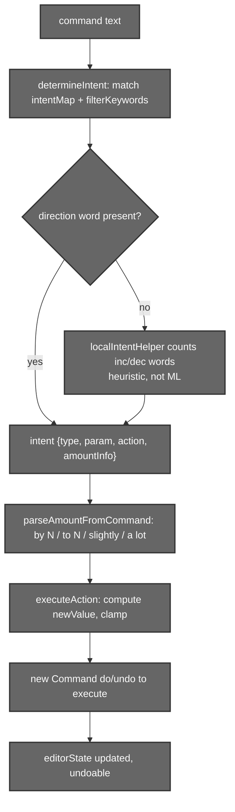
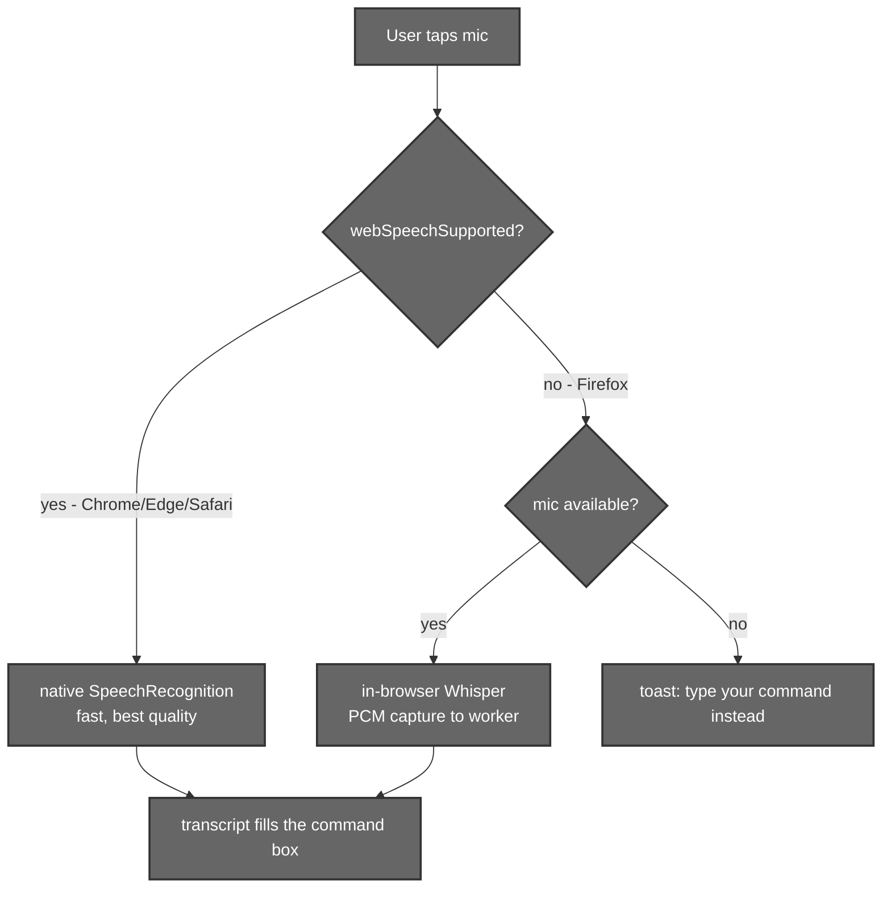

# Voice Input & the Heuristic Command Parser

## 1. Introduction

Aurora lets you **edit by talking or typing**: *"increase brightness a lot"*,
*"apply a warm filter"*, *"rotate left"*, *"reset"*. Two cooperating systems make
this work:

1. A **heuristic command parser** that maps natural language to concrete editor
   adjustments — fast, offline, deterministic.
2. A **voice‑input layer** that turns speech into that text, using a hybrid of
   the browser's native Web Speech API where available and an in‑browser
   **Whisper** model where it isn't.

Anything the parser *can't* interpret as a local adjustment falls through to the
[Qwen AI editor](./06-qwen-inpainting.md). So the command bar is one box with
three tiers: **voice → local parser → AI**.

---

## 2. Files that hold the logic

| File | Responsibility |
|------|----------------|
| `src/components/MainEditor/Utils/CommandInputUtils.js` | The heuristic parser: `processCommand`, `determineIntent`, `parseAmountFromCommand`, `executeAction`, the `intentMap` and `filterKeywords`. |
| `src/components/MainEditor/UI/CommandInput.jsx` | The command bar UI + voice capture: Web Speech vs Whisper, PCM recording, `isStarting`/`isListening` state, error toasts, the local‑vs‑AI branch. |
| `src/components/MainEditor/Utils/whisperClient.js` | Main‑thread RPC to the Whisper worker (`preloadWhisper`, `transcribe`). |
| `src/components/MainEditor/Utils/whisperWorker.js` | The Whisper Web Worker (loads transformers.js from CDN, runs ASR). |

---

## 3. The heuristic command parser

### 3.1 Two entry points

There are actually **two** parser functions, and `CommandInput` picks one:

- **`processCommand`** — a direct keyword matcher with **fixed steps** (±20 for
  brightness/contrast/saturation, ±2 for blur). It does *not* parse magnitudes.
  Used as the fallback.
- **`processCommandWithAI` → `determineIntent` → `executeAction`** — the richer
  path. It adds **magnitude parsing** (`by N` / `to N` / `slightly` / `a lot`)
  and, when an adjustment is named but no explicit increase/decrease word
  appears, calls a small **direction helper** (`aiModel`) to guess the
  direction. `CommandInput` uses this path once that helper has "loaded"
  (~1 s after mount), so in practice it is the default.

> **Naming caveat:** the helper is referred to in code as `aiModel` /
> `loadAIModel` / `modelStatus`, but it is **not** a neural network. It's
> `localIntentHelper` — a tiny function that counts increase‑ vs decrease‑words
> (`more/brighter/boost…` vs `less/darker/reduce…`) and returns
> `INCREASE`/`DECREASE`/`NEUTRAL` with a heuristic score. No model is downloaded
> for command parsing.



### 3.2 The intent map

The parser recognises four numeric adjustments plus filters, transforms and
reset. Each adjustment carries keyword + increase/decrease synonym lists:

```js
intentMap = {
  brightness: { keywords:['bright','brightness','light','dark','darker','brighter','illuminate'],
                increase:['increase','up','more','brighter','lighter','brighten'],
                decrease:['decrease','down','less','darker','dimmer','darken'] },
  contrast:   { keywords:['contrast','sharp','definition','clarity'], … },
  saturation: { keywords:['saturation','color','vibrant','vivid','colorful','saturate'], … },
  blur:       { keywords:['blur','blurry','focus','sharp'], … },
}
```

Filters map to LUT families via `filterKeywords` (warm, cool, vintage,
cinematic, bright, dark, colorful), e.g. *warm* ← `['warm','golden','sunset',
'amber','cozy','coffee']`.

### 3.3 Magnitude & direction

`parseAmountFromCommand` extracts how much to change (used by the
`processCommandWithAI` path; the simple `processCommand` fallback ignores
magnitudes and uses fixed steps):

| Phrase | Result |
|--------|--------|
| `"by 20"` | relative, value 20 |
| `"to 150"` | absolute, value 150 |
| `"slightly"`, `"a bit"`, `"a little"` | relative, value 10 |
| `"a lot"`, `"significantly"`, `"strong"` | relative, value 40 |
| *(no modifier)* | relative, default 20 (blur: 2) |

### 3.4 Applying the change

`executeAction` turns the intent into an editor delta and clamps it to the
range, honouring the **neutral = 100** convention:

- Brightness / contrast / saturation → clamped to `[0, 200]`.
- Blur → clamped to `[0, 20]` (relative steps scaled down).
- Rotate → ±90° modulo 360; flip → toggles `flipH`/`flipV`.
- Reset → all adjustments back to defaults (brightness/contrast/saturation 100,
  blur 0, etc.) and `selectedLUT` cleared.

The result is wrapped in a `Command(do, undo)` and passed to `execute`, so every
voice/text edit is **undoable** exactly like a slider edit
([03 – History](./03-history.md)).

### 3.5 Local vs AI

`CommandInput.handleSendCommand` tries the local parser first; only on a miss
does it route to `onAICommand` (Qwen). This keeps cheap, common edits instant and
offline, reserving the remote model for genuinely creative requests:

```js
// local first — richer path when the direction helper is ready, else the simple matcher
const localSuccess = aiModel && modelStatus === 'ready'
  ? await processCommandWithAI(inputText, execute, options, Command, editorState, aiModel)
  : processCommand(inputText, execute, Command, editorState);
let success = localSuccess;
if (!localSuccess && onAICommand) success = await onAICommand(prompt);   // → Qwen
else if (!localSuccess && addToast) addToast('This feature is currently unavailable.', 'error');
```

---

## 4. Voice input

### 4.1 Hybrid strategy



Feature detection: `webSpeechSupported` checks for
`SpeechRecognition`/`webkitSpeechRecognition`; if absent but a mic exists,
`useWhisper` is chosen.

### 4.2 Native Web Speech (Chrome/Edge/Safari)

A `SpeechRecognition` instance (`continuous=false`, `interimResults=true`,
`lang='en-US'`) streams the transcript straight into the command box. Errors map
to toasts: `not-allowed` → mic denied, `no-speech` → "no speech detected",
others → generic error.

### 4.3 In‑browser Whisper (Firefox)

When Web Speech isn't available, Aurora runs **Whisper Tiny (English)** entirely
in the browser:

- **Loaded from CDN at runtime, not bundled.** `whisperWorker.js` does
  `import('https://cdn.jsdelivr.net/npm/@xenova/transformers@2.17.2')` (with
  `@vite-ignore`). Bundling it via Vite caused a `registerBackend … undefined`
  crash, because transformers.js bundles *its own* `onnxruntime-web` that clashes
  with the app's ORT (used by the [colour‑grading worker](./05-color-grading.md)).
  The CDN build is self‑contained.
- **Runs in a Web Worker** (`whisperWorker.js`) so transcription never freezes
  the UI. The model is **preloaded ~2.5 s after mount** and **browser‑cached**, so
  there's no re‑download. `whisperClient.js` is the RPC layer
  (`preloadWhisper`, `transcribe`).

### 4.4 Audio capture (the hard part)

Firefox is captured with **direct PCM via the Web Audio `ScriptProcessor`, not
`MediaRecorder`**. `MediaRecorder` plus an analyser on the same mic stream made
Firefox record **silence** (~700‑byte blobs → Whisper hallucinated "you" for
everything). The PCM path taps the mic once, gives raw samples **and** a level
meter, and resamples to 16 kHz (`resampleTo16k`) for Whisper.

A deliberately *honest* UX detail: `setIsListening(true)` only fires **after**
the PCM tap is connected — never optimistically before `getUserMedia`. An
earlier optimistic version showed "Listening" before capture was live, so users
spoke into a dead mic and got clipped words. The brief mic spin‑up is shown via
the `isStarting` loader instead.

### 4.5 Error handling

Every failure mode surfaces as a toast (no silent console logs): transcription
error, model load‑error forwarded from the worker, mic‑permission denial,
empty/no‑speech capture, and unsupported‑browser.

---

## 5. Models used

| Model | Where | What it does |
|-------|-------|--------------|
| **Whisper Tiny (English)** | Browser (Firefox path), Web Worker | Speech‑to‑text when Web Speech API is unavailable. |
| *Native Web Speech API* | Browser (Chrome/Edge/Safari) | OS/browser speech recognition — not a bundled model. |

### Model detail — Whisper Tiny EN

| Property | Value |
|----------|-------|
| Model id | `Xenova/whisper-tiny.en` |
| Runtime | transformers.js `automatic-speech-recognition` pipeline |
| Loading | CDN `@xenova/transformers@2.17.2` at runtime (not bundled), browser‑cached |
| Audio | mono PCM via Web Audio `ScriptProcessor`, resampled to 16 kHz |
| Origin | OpenAI Whisper, ONNX build by Xenova |
| Repo | <https://github.com/openai/whisper> · <https://huggingface.co/Xenova/whisper-tiny.en> |

The **command parser itself uses no model** — it's deterministic keyword/intent
matching.

---

## 6. Summary

- One command bar, three tiers: **voice → local heuristic parser → remote AI**.
- The parser maps natural language to clamped, undoable editor adjustments via
  an intent map + magnitude parser; neutral = 100.
- Voice is a hybrid: native Web Speech where supported, in‑browser Whisper Tiny
  (loaded from CDN, run in a worker, PCM‑captured) elsewhere.
- Hard‑won details — CDN‑not‑bundled Whisper, PCM‑not‑MediaRecorder capture,
  honest mic spin‑up — are intentional; don't "simplify" them away.
