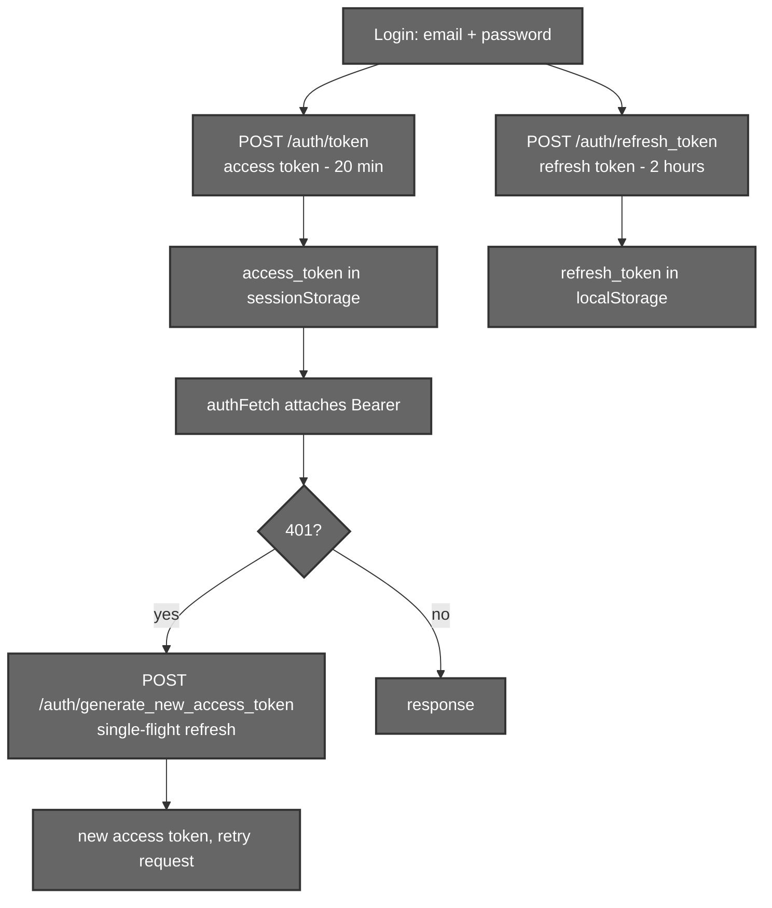

# Accounts & Image Library

## 1. Introduction

Aurora is account‑based: a user signs up, verifies their email, logs in, and
their **saved images** live in a personal library on the server. This document
covers the two supporting systems that make the editor a real app rather than a
toy:

- **Authentication** — sign‑up, login, JWT access/refresh tokens, email
  verification, and password reset.
- **The image library** — saving the finished edit to your gallery, and
  listing, thumbnailing, renaming and deleting saved images.

Every protected backend endpoint (segmentation, Qwen, library) sits behind the
same JWT check, so this layer underpins all the AI features documented
elsewhere.

---

## 2. Files that hold the logic

### Backend

| File | Responsibility |
|------|----------------|
| `backend/Routers/auth.py` | Sign‑up, login (`/token`, `/refresh_token`), access‑token refresh, forgot/reset password, email verify, and `get_current_user` (the JWT dependency). |
| `backend/Routers/user.py` | The image library: `upload-image`, list (`GET /user/`), `get_image`, thumbnail, `rename-image`, `delete-image`. |
| `backend/mail_config.py` | `fastapi-mail` setup for verification/reset emails. |
| `backend/database.py` | `User` and `Image` models, async SQLAlchemy session. |

### Frontend

| File | Responsibility |
|------|----------------|
| `src/components/Auth/UI/*` | Login, sign‑up, forgot/reset‑password, verify‑email screens (`Auth.jsx`, `LoginForm.jsx`, …). |
| `src/components/Auth/handlers/*` | Form submit handlers (`handLogIn.js`, `handleSignUp.js`, `handleResetPassword.js`, `handleChangePassword.js`). |
| `src/store/UserContext.jsx` | The user/session store: `uploadImage`, `fetchImage`, `deleteImage`, image cache, and the single‑flight token refresh. |
| `src/utils/authFetch.js` | Authenticated `fetch` for non‑React API modules — attaches the Bearer token and transparently refreshes on a 401. |

---

## 3. Authentication

### 3.1 Token model

- Passwords are hashed with **bcrypt** (`passlib`); the plaintext is never
  stored.
- Tokens are **JWT** (`HS256`, signed with `SECRET_KEY`) and carry a `type`
  claim (`access` / `refresh` / `reset` / `verify`). `get_current_user` rejects
  any token whose `type` isn't `access`, so a refresh or reset token can't be
  used to call the API. The reset/verify flows likewise require their exact type.
- **Lifetimes:** access = 20 min, refresh = 2 h, reset/verify = 20 min.
- **Storage split:** the short‑lived access token lives in `sessionStorage`; the
  longer refresh token in `localStorage`. On a 401, both `authFetch` and
  `UserContext` perform a **single‑flight** refresh (concurrent calls share one
  in‑flight refresh promise) and retry once.

### 3.2 Email flows

`forgot_password` and `verify_email` mint a typed token and email a link
(`{FRONTEND_URL}/reset_password/{token}` or `/verify_email/{token}`) via a
FastAPI **background task**, so the request returns immediately. The matching
`PUT` endpoints validate the typed token and update the user (`hashed_password`
or `verified`).

### 3.3 Routing guard (frontend)

The `/editor` route is wrapped in a `PrivateRoute`; `UserContext` validates the
session on mount (refreshing if needed) and bounces unauthenticated users to
`/auth`. The landing page `/` and `/auth` are public.

---

## 4. The image library

### 4.1 Saving an edit

When the user picks **Save**, the editor flattens the canvas to a full
native‑resolution PNG (the same `flattenRef` used for download — see
[01 – Canvas Rendering](./01-canvas-rendering.md)) and uploads it:

The server stores the file under a random UUID name in `images/` and records an
`Image` row (`stored_name`, `original_name`) owned by the user. The store
optimistically prepends the new image so the library updates instantly.

### 4.2 Library endpoints

| Method | Path | Purpose |
|--------|------|---------|
| `POST` | `/user/upload-image` | Save a finished image to the gallery. |
| `GET` | `/user/` | The user profile + their image list (newest first). Pass `include_image_data=true` to inline base64. |
| `GET` | `/user/image/{stored_name}` | Fetch one full image as base64. |
| `GET` | `/user/image/{stored_name}/thumbnail?size=300` | A JPEG thumbnail (LANCZOS, quality 85). |
| `PUT` | `/user/rename-image` | Rename (changes `original_name`). |
| `DELETE` | `/user/delete-image/{stored_name}` | Remove the row **and** the file. |

Every endpoint re‑checks ownership (`get_owned_image` joins `Image → User` on
the caller's email), so users can only touch their own images.

### 4.3 Frontend caching

`UserContext` keeps an in‑memory `imageCache` (`Map<stored_name, data>`) so
re‑opening the library doesn't re‑download images. `deleteImage` evicts the
cache entry and removes it from `user.images`; thumbnails are used for the grid
to keep payloads small.

---

## 6. Summary

- JWT auth with typed tokens (access/refresh/reset/verify), bcrypt passwords,
  and a single‑flight refresh shared by `authFetch` and `UserContext`.
- Email verification and password reset run as background‑task emails with
  short‑lived typed tokens.
- The library saves the flattened, full‑res PNG to a per‑user gallery with
  list/thumbnail/rename/delete, all ownership‑checked.
- Pure infrastructure — no models — but it's the gate every protected AI
  endpoint sits behind.
